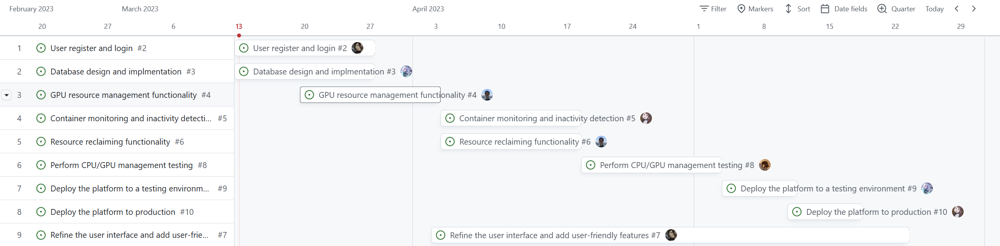

<b>[CS304] Requirement Analysis Report</b>

> Project Name: 
>
> Project Member: 黄北辰，邬一帆，余乃蔚，刘晟淇，张闻城

[toc]

<b>Review History</b>

| **Date**  | **Revision Version** | **Description**                      | **Author** |
| --------- | -------------------- | ------------------------------------ | ---------- |
| 2023-2-27 | v0.1                 | Initial Draft Created                | 张闻城     |
| 2023-3-2  | v0.2                 | Requirement detail                   | 黄北辰     |
| 2023-3-7  | v1.0                 | The first version of the plan passed | 全体组员   |
| 2023-3-9  | v1.1                 | Revise suggested deliverables        | 余乃蔚     |

# 1. Overview

## 1.1 Motivation

Our proposed project is a CPU/GPU server management platform that enables users to create containers with a specified amount of CPU/GPU resources. Our project is motivated by the fact that there are currently many groups on campus that have their own used for computationally intensive tasks such as deep learning, machine learning, etc. This creates certain requirements on the server hardware and the computational resources (CPU/GPU) that can be allocated to a particular user when running. What is known is that there is no method to manage the scheduling and allocation of hardware resources within the corresponding servers on campus. The amount of computing resources available to the user is dependent on the operating system. The problem with this is that one user may be allocated too many unnecessary computing resources, resulting in a waste of resources and reducing the efficiency of other users. So we wanted to develop an application that would improve this situation.

## 1.2 Target User or Clients Characteristics

The target users for this system are data scientists, machine learning engineers, and researchers who require significant computational power to execute their algorithms in our campus. Here are some potential characteristics of our target users:

- High demand for CPU/GPU resources: Users will likely have a high demand for CPU/GPU resources, and may require a flexible platform that can scale resources up or down as needed.

- Budget-conscious: Users are likely to be budget-conscious, and may be looking for an affordable platform that allows them to optimize their resource usage and costs.

- Time-sensitive: Users may have time-sensitive workloads, and may require a platform that provides fast and reliable CPU/GPU resources that can be easily accessed and managed.

## 1.3 Project Scope

The project scope for the CPU/GPU server management platform specifies the contents and functionalities that are within the system's scope. These include:

- User Registration and Login: The platform should allow users to create an account and login to access the platform's functionalities.

- Container Creation: Users should be able to create containers with CPU/GPU resource allocation.

- Resource Allocation: The platform should allocate CPU/GPU resources to containers based on the user's preferences and availability.
- Monitoring and Reclamation: The platform should monitor the container's resource usage and reclaim the resources if the user is inactive for a long time.

- User Notification: The platform should notify users of resource allocation, resource usage, and reclamation, and send alerts for any critical events or issues.

- Admin Management: The platform should have an admin panel to manage users, containers, and resources.

- Resource Usage Statistics and Reports Generation Functionality: The platform should provide resource usage statistics and reports generation functionality for users and admins.

The service objective of the CPU/GPU server management platform is to provide a solution for managing and utilizing CPU/GPU resources efficiently for various users and clients, including developers, data scientists, researchers, and enterprises. The platform aims to provide a user-friendly UI, modern technologies, and Agile Scrum development to deliver a high-quality platform that meets the users' and clients' needs and requirements.

## 1.4 Overall Goal

The overall goal of the CPU/GPU server management platform is to provide a scalable, reliable, and efficient solution for managing and utilizing CPU/GPU resources for various users and clients, including developers, data scientists, researchers, and enterprises.

The expected scenario of the users is that they can easily create containers with CPU/GPU resource allocation, run their workloads, and monitor resource usage. If a user is inactive for a long time, the platform will reclaim the resources to optimize resource utilization.

The expected outcome of the CPU/GPU server management platform is to provide users and clients with a high-performance computing platform that reduces resource waste and increases resource utilization efficiency. The platform should also provide accurate resource usage statistics and reports to help users and admins make informed decisions.

Additionally, the platform should be secure, reliable, and scalable to handle increasing resource demands and user traffic. It should also be user-friendly and easy to use, with a modern UI and responsive design.

Overall, the goal of the CPU/GPU server management platform is to improve CPU/GPU resource management and utilization, enabling users and clients to focus on their workloads and tasks without worrying about resource allocation and management.

# 2. Development Process

## 2.1 Process Models

The process model for the CPU/GPU server management platform is Agile Scrum. The Agile Scrum methodology is a flexible and iterative approach to software development that emphasizes collaboration, customer satisfaction, and continuous improvement.

We chose the Agile Scrum model because it offers several benefits, including:

- Flexibility: Agile Scrum allows for changes and adjustments to be made throughout the development process, which is essential for a project with evolving requirements.

- Iterative approach: The development process is divided into sprints, each of which delivers a working product increment. This allows for early and continuous feedback from stakeholders, which helps to identify and address issues early in the development process.

- Collaboration: Agile Scrum emphasizes teamwork and collaboration between developers, stakeholders, and customers. This helps to ensure that everyone is aligned with the project goals and requirements, and that issues are addressed quickly and effectively.

- Customer satisfaction: Agile Scrum places a high value on customer satisfaction, with regular customer feedback and involvement in the development process. This helps to ensure that the final product meets the customer's needs and requirements.

The Agile Scrum process model for the CPU/GPU server management platform will consist of sprints, each of which will be two weeks long. At the end of each sprint, a working product increment will be delivered, and the team will hold a sprint review meeting to receive feedback from stakeholders and customers. The team will also hold a sprint retrospective meeting to identify areas for improvement and discuss ways to optimize the development process.

## 2.2 Project Schedule

Project Manager: 黄北辰

Business Manager: 张闻城 

Technical Architect: 邬一帆，黄北辰

Testing engineer: 余乃蔚，刘晟淇

# 3. Suggested Deliverables

## 3.1 Milestone 2 Deliverable

The suggested deliverables for Milestone 2 include:

- Functional requirements specification document: This document will detail the functional requirements of the CPU/GPU server management platform, including user management, container management, resource allocation and reclamation, and logging and monitoring.

- High-level design document: This document will describe the overall architecture of the CPU/GPU server management platform, including the different components, how they interact with each other, and their responsibilities.

- User interface prototype: A prototype of the user interface will be developed to provide stakeholders and customers with a visual representation of the platform's functionalities.

- Working code: A working code of the CPU/GPU server management platform with at least 50% of the basic functionalities implemented.

- Test suite: A test suite will be developed to ensure that the implemented functionalities meet the requirements specified in the functional requirements specification document.

## 3.2 Milestone 3 Deliverable

The suggested deliverables for Milestone 3 include:

- User manual: A user manual will be provided to guide users on how to use the platform and its functionalities.
- Technical documentation: Technical documentation will be provided to explain the underlying technologies used to develop the CPU/GPU server management platform.
- Source code: The source code of the CPU/GPU server management platform will be delivered, including all documentation and test cases.
- Deployment guide: A deployment guide will be provided to explain how to install and configure the CPU/GPU server management platform.
- Training materials: Training materials will be provided to train users on how to use the platform and its functionalities.
- Completed CPU/GPU server management platform: The final delivery will include the completed and tested CPU/GPU server management platform with all the required functionalities implemented, tested, and ready for deployment.

The programming languages and techniques used for developing and executing these deliverables will be determined based on the requirements of each deliverable. For instance, the source code will be developed using programming languages suitable for the various components, such as Python for the backend, and JavaScript for the frontend. Documentation and training materials will be developed using appropriate tools and techniques, such as Markdown and HTML. Finally, the test suite will be developed using testing frameworks suitable for the various components, such as PyTest for the backend.

# 4. Requirements

## 4.1 Functional Requirements

1. User Registration and Authentication: The platform must provide a user registration and authentication mechanism to allow users to create an account and log in to the system securely.
2. Resource Allocation: The platform should allow users to allocate CPU and CPU/GPU resources to their containers based on their requirements. The system should be able to track and manage resource allocation effectively to avoid resource over-commitment.
3. Container Creation: The platform should allow users to create containers with a specified amount of CPU and CPU/GPU resources. The system should ensure that the resources allocated to each container are available and not being used by other containers or users.
4. Container Management: The platform should allow users to manage their containers efficiently. Users should be able to start, stop, pause, and delete containers as required. The system should also provide a mechanism to monitor container performance and resource usage.
5. Resource Reclamation: If a user is inactive for a long time or no longer requires their allocated resources, the system should automatically reclaim the resources and make them available for other users. The platform should provide a configurable time-out mechanism to determine when to reclaim resources based on user activity.
7. Security and Access Control: The platform should provide adequate security measures to ensure the safety and confidentiality of user data and prevent unauthorized access. The system should also provide access control mechanisms to restrict user access to resources based on their roles and permissions.

## 4.2 Non-Functional Requirements

### 4.2.1 Quality requirements

1. Reliability: The platform should provide reliable services by ensuring that it is capable of providing correct and continuous operation results. The system should be designed to minimize the chances of system failure, data loss, or downtime.
3. Ease of Use: The platform should be easy to use for users with varying levels of technical expertise. The user interface should be intuitive and straightforward, and the system should provide clear and concise documentation to assist users.
4. Execution Speed: The platform should execute operations at a reasonable speed to ensure that users do not experience delays or slow response times. The system should be optimized to perform efficiently and effectively.
5. Exception Processing: The platform should be able to handle exceptions and errors gracefully. The system should provide clear and informative error messages to assist users in troubleshooting issues and recovering from errors.
6. Scalability: The platform should be scalable to handle a growing number of users and containers. The system should be able to handle increased load without compromising performance or availability.
7. Security: The platform should be secure to protect user data and prevent unauthorized access. The system should provide mechanisms for authentication, authorization, and data encryption to ensure data confidentiality and integrity.
8. Maintainability: The platform should be easy to maintain and support. The system should be modular and well-structured, with clear and concise documentation to assist developers in maintaining and updating the system.
9. Compatibility: The platform should be compatible with a wide range of hardware and software platforms. The system should be designed to support multiple operating systems, browsers, and devices to ensure that it can be used by a wide range of users.
10. Availability: The platform should be available to users at all times. The system should be designed to provide high availability by minimizing downtime and providing mechanisms for disaster recovery.

### 4.2.2 Safety requirements

1. Password Storage: The platform should store user passwords securely to prevent unauthorized access to user accounts. The system should store passwords in a hashed and salted format, making it difficult for attackers to obtain user passwords in the event of a data breach.
2. Privacy: The platform should provide mechanisms to protect user privacy by ensuring that user data is not shared with third parties without user consent. The system should provide clear and concise privacy policies to inform users about data collection, storage, and use.
3. Authentication and Authorization: The platform should provide robust authentication and authorization mechanisms to ensure that only authorized users can access the system and its resources. The system should provide mechanisms for multi-factor authentication, role-based access control, and session management to prevent unauthorized access and ensure user accountability.
4. System Monitoring: The platform should provide mechanisms for system monitoring and alerting to detect and respond to security incidents and abnormal system behavior. The system should provide real-time monitoring of system resources, user activity, and security events to detect and respond to threats promptly.
5. Incident Response: The platform should provide an incident response plan to ensure that security incidents are handled appropriately. The system should provide clear procedures for reporting, investigating, and responding to security incidents to minimize the impact on users and the system.

# 5. Constraints

## 5.1 Operation Environment

1. Hardware resources: The CPU/GPU server management platform will require access to hardware resources, such as CPU/GPUs, to allocate to users. Therefore, the operating environment must have access to a sufficient number of CPU/GPUs to support the number of users who will be accessing the platform.
2. Operating system compatibility: The platform will need to run on an operating system that is compatible with the hardware resources being used. For example, if the CPU/GPUs being used require specific drivers or libraries, the operating system must be compatible with those components.
3. Containerization technology: To create containers with CPU/GPU resources, the platform will need to use containerization technology such as Docker or Kubernetes. Therefore, the operating environment must support these technologies and provide the necessary resources to run them.
8. Resource allocation policies: The platform will need to have well-defined resource allocation policies to ensure that resources are allocated fairly and efficiently among users. These policies may include limits on resource usage, policies for reclaiming unused resources, and mechanisms for prioritizing resource allocation based on user needs.

## 5.2 Design and Implementation

1. Platform type: The CPU/GPU server management platform can be designed and implemented as a web-based platform, which users can access through a web browser or an API. Alternatively, it can be designed as a standalone desktop application, which users can install and run on their local machines.
2. Development language and tools: The choice of programming language and tools used for the development of the platform can impact the scalability, maintainability, and overall performance of the system. Some commonly used programming languages and tools for building CPU/GPU server management platforms include Python, Java, C++, and Go. Additionally, containerization tools like Docker and Kubernetes can be used to manage the containers.
3. User interface and experience: The platform should be designed to provide a user-friendly interface for users to manage their containers, view usage statistics, and access other relevant information. The interface should be intuitive and easy to navigate, with clear and concise information about the user's resources and usage.
4. Performance and scalability: The platform should be designed to handle large volumes of users and be able to scale up or down as demand fluctuates. The system should be able to allocate resources efficiently and ensure that users have access to the resources they need to complete their tasks.
5. Security and access controls: The platform should be designed with strong security features to protect user data and prevent unauthorized access to resources. This may include authentication and access control mechanisms, encryption of data in transit and at rest, and monitoring for potential security breaches.
6. Resource allocation policies: The platform should have well-defined resource allocation policies to ensure that resources are allocated fairly and efficiently among users. These policies may include limits on resource usage, policies for reclaiming unused resources, and mechanisms for prioritizing resource allocation based on user needs.
7. Monitoring and logging: The platform should include monitoring and logging capabilities to track user activity, resource usage, and system performance. This information can be used to troubleshoot issues and optimize resource allocation.
8. Compatibility with hardware and software: The platform should be designed to be compatible with a variety of hardware and software configurations, including different CPU/GPU models, operating systems, and containerization technologies.

